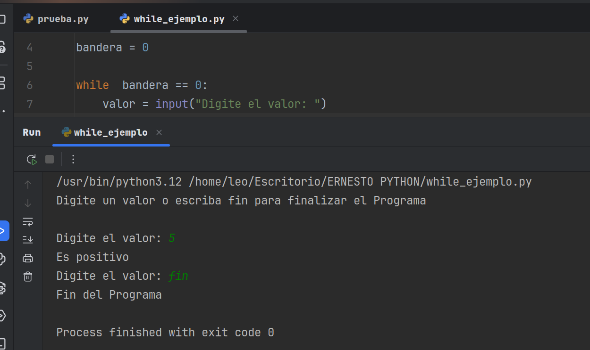

# Bucle while en Python
Este proyecto demuestra una aplicación práctica del bucle while en Python
para la validación de entrada de usuario y el control de flujo.
El script permite al usuario ingresar valores continuamente, validando si son números enteros y
clasificándolos (positivo, negativo, cero), hasta que se introduce una palabra clave para finalizar
el programa.

## Características Clave:
## Que muestra: 
Muestra cómo gestionar la repetición de un bloque de código basada en una condición.

## Validación de Entrada: 
Implementa comprobaciones (isdigit()) para asegurar que la entrada del usuario sea un número válido.

## Control Condicional (if-elif-else):
Utiliza anidación de condicionales para procesar diferentes tipos de entrada (positivo, negativo, cero, no numérico).

## Experiencia de Usuario Básica: 
Ofrece interacción con el usuario y mensajes claros para guiar el flujo del programa.

## Utilizamos la variable bandera para:
controlar la ejecución del bucle while.

## Este ejemplo subraya mi capacidad para:

## Manejar interacciones con el usuario: 
Construir interfaces de línea de comandos simples pero funcionales.

## Implementar lógica de control:
Utilizar while e if/else para crear programas robustos y con un flujo definido.

## Escribir código defensivo: 
Validar entradas para prevenir errores y mejorar la robustez de las aplicaciones.

Fundamentos Sólidos: Demostrar un entendimiento claro de los bloques de construcción esenciales de cualquier aplicación.
## Como se ve la ejecucion en pantalla: 
- 

- * **Autor: @AndresGolDev** - [**Github link:**]([https://github.com/tu-usuario](https://github.com/AndresGolDev)
